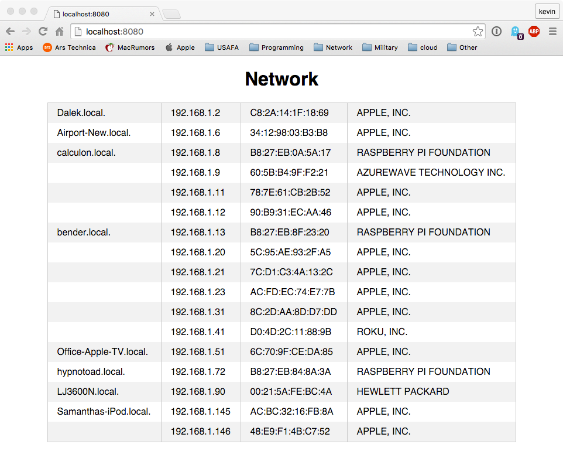

# Nodescan

I have a lot of things on my network and I don't even know what they are half the time.
This is an alternative to `fing` which is pretty good, but you need to buy a license to
get full control.

The main purpose of this is network recon to find and identify hosts.

## Install

    npm install -g

### Develop

    git clone https://github.com/walchko/nodescan.git
    cd nodescan
    npm install
    npm link

### OSX

    brew install arp-scan

### Linux

    sudo apt-get install arp-scan

## Usage

    [kevin@Tardis nodescan]$ nodescan -h

      Usage: nodescan nodescan [options]

      Local network scanner with web interface

      Options:

        -h, --help              output usage information
        -V, --version           output the version number
        -d, --dev [interface]   network interface to use for scan, default: en1
        -l, --loc [location]    save file location, default location: ~
        -p, --port <port>       Http server port number, default: 8888
        -u, --update [seconds]  update time for arp-scan, default: 60 sec

## Setup

For RPi, install this in `/etc/systemd/system/nodescan.service`, this will ensure it runs at start up.

    [Service]
    ExecStart=/usr/local/bin/nodescan -d eth0 -l /var/run
    Restart=always
    StandardOutput=syslog
    StandardError=syslog
    SyslogIdentifier=nodescan
    User=root
    Group=root
    Environment=NODE_ENV=production

    [Install]
    WantedBy=multi-user.target

Then do:

    sudo systemctl enable nodescan.service
    sudo systemctl start nodescan.service

Now use a browser to go to `<your rpi>:8888` and see the results.

You can also use `sudo systemctl start|stop|status nodescan.service` to start, stop, or find the current status of the server.

## To Do

* Scan hosts for open ports (easy) and figure out a smart way to put that on the web page (harder)
* Save/recover network database from file, [having issues reading file back in]
* Do I need to show the mac addr? Is there a better way to do that?
* Maybe put a json interface?
* Turn on/off web interface, then just use json to get info?
* Add tests

## Change Log

| Version | Date      | Comments |
|---------|-----------|----------|
| 0.7.1   |  5 Nov 16 | Fixed file error |
| 0.7.0   | 17 Jul 16 | Fixed readme |
| 0.6.0   |  9 Jan 16 | Fixed MAC/IP issues with changing addresses, ensure root/sudo privileges, user define file save location |
| 0.5.0   |  9 Jan 16 | Clean-up and fixes |
| 0.4.0   |  8 Jan 16 | Clean-up and fixes |
| 0.3.0   |  6 Jan 16 | Clean-up and fixes, still have a file error to fix |
| 0.2.0   |  3 Jan 16 | Clean-up and fixes |
| 0.1.0   |  1 Jan 16 | Initial commit |
